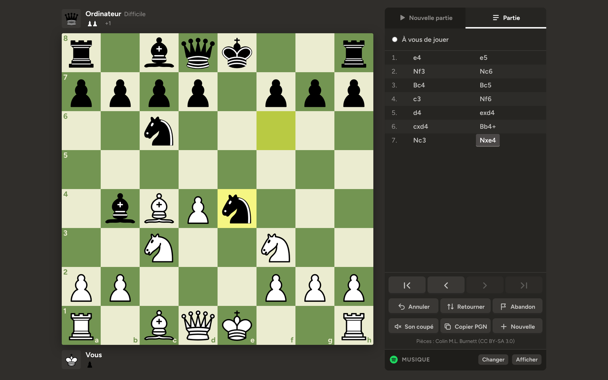
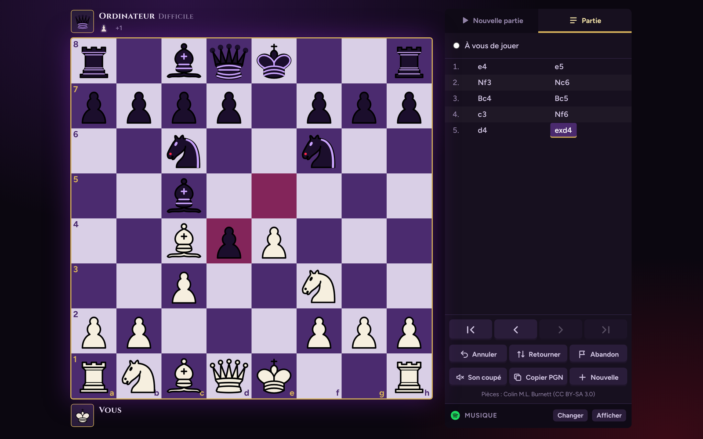
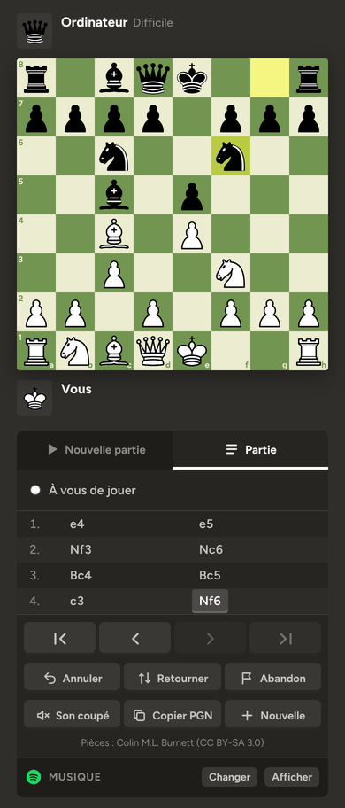

<div align="center">

# ♟️ Échiquier Vert

**Un jeu d'échecs complet qui tourne dans le navigateur, sans installation ni dépendance.**

[](https://github.com/b3ydi/echiquier-vert/actions/workflows/deploy.yml)
[](LICENSE)


### [▶ Jouer maintenant](https://b3ydi.github.io/echiquier-vert/)



</div>

## Fonctionnalités

- **Toutes les règles** : roque, prise en passant, promotion, pat, répétition, règle des 50 coups, matériel insuffisant.
- **Mode histoire « Le Cercle du Roi Noir »** : un fan game à la Code Geass. Lelouch, piégé dans un cercle d'échecs clandestin, doit battre six maîtres de plus en plus forts pour retrouver sa liberté. Dialogues entre les matchs, progression sauvegardée et pouvoir Geass (le meilleur coup révélé, une fois par partie).
- **Contre l'ordinateur**, 5 niveaux de difficulté. L'IA cherche en arrière-plan (Web Worker), l'interface ne fige jamais.
- **À deux** sur le même écran.
- **Pendules** avec plusieurs cadences.
- **Confort de jeu** : glisser-déposer ou clic, aperçu des coups légaux, flèches et marques au clic droit.
- **Analyse** : historique des coups navigable au clavier, export PGN en un clic.
- **5 thèmes d'échiquier**, dont un thème « Geass » noir, violet et or.
- **Musique** : lecteur Spotify intégré, avec votre propre playlist.
- **Sons** synthétisés, partie sauvegardée automatiquement (on reprend là où on s'était arrêté).
- **Responsive** : jouable sur ordinateur, tablette et téléphone.

<table>
  <tr>
    <td></td>
    <td></td>
  </tr>
  <tr>
    <td align="center"><sub>Thème Geass</sub></td>
    <td align="center"><sub>Sur téléphone</sub></td>
  </tr>
</table>

## Démarrage rapide

Aucune installation : ouvrez simplement [`src/index.html`](src/index.html) dans un navigateur.

Avec [Node.js](https://nodejs.org) 18 ou plus :

```bash
git clone https://github.com/b3ydi/echiquier-vert.git
cd echiquier-vert
npm test         # vérifie le moteur
npm run build    # produit dist/index.html, le jeu en un seul fichier
```

## Structure du projet

```
echiquier-vert/
├── src/
│   ├── index.html     # structure de la page
│   ├── styles.css     # apparence et thèmes
│   ├── app.js         # interface : plateau, pendules, menus, sons, musique
│   ├── engine.js      # moteur : règles des échecs et intelligence artificielle
│   └── favicon.svg
├── test/
│   └── engine.test.mjs   # tests du moteur (perft, fins de partie, IA)
├── scripts/
│   └── build.mjs      # assemble src/ en un fichier unique dist/index.html
├── docs/              # captures d'écran du README
└── .github/workflows/
    └── deploy.yml     # tests + mise en ligne automatique sur GitHub Pages
```

## Sous le capot

- **Moteur** (`src/engine.js`) : génération des coups légaux sur un tableau de 64 cases, validée par [perft](https://www.chessprogramming.org/Perft_Results) sur 5 positions de référence (plus de 300 000 positions vérifiées à chaque test).
- **IA** : recherche alpha-bêta avec approfondissement itératif, recherche de quiescence, tri des coups et tables pièce-case. Les niveaux faciles ajoutent un peu de hasard pour rester humains.
- **Interface** : JavaScript sans framework, SVG pour les pièces, Web Audio pour les sons.
- **Build** : un script Node de 25 lignes, sans dépendance, qui insère CSS et JS dans la page.

## Mettre à jour le jeu

Chaque modification envoyée sur la branche `main` est testée puis mise en ligne automatiquement :

1. Modifiez un fichier dans `src/` (directement sur GitHub avec l'icône ✏️, ou sur votre ordinateur).
2. Validez (*commit*) sur `main`.
3. Après une minute environ, la nouvelle version est en ligne sur [b3ydi.github.io/echiquier-vert](https://b3ydi.github.io/echiquier-vert/).

L'onglet **Actions** du dépôt montre l'avancement. Si un test échoue, la version en ligne n'est pas touchée.

## Licence

Code sous licence [MIT](LICENSE).
Pièces : jeu « cburnett » de Colin M.L. Burnett, sous licence [CC BY-SA 3.0](https://creativecommons.org/licenses/by-sa/3.0/).
