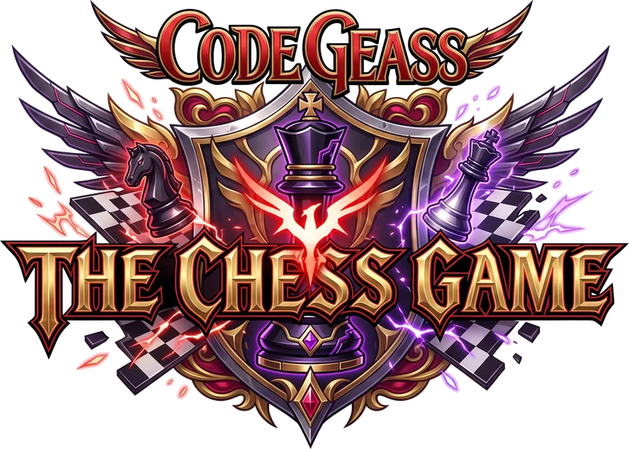
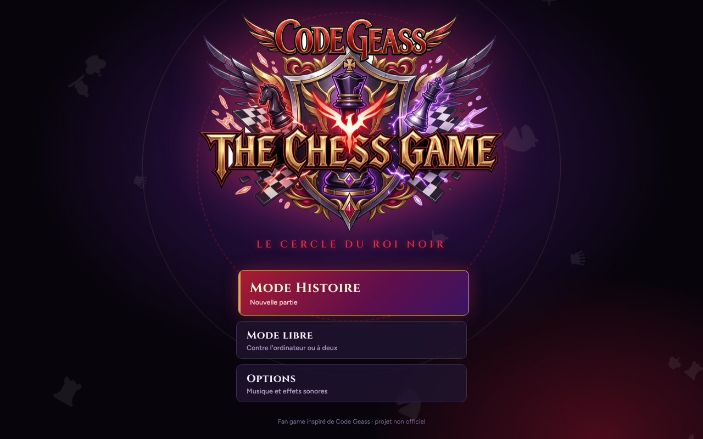
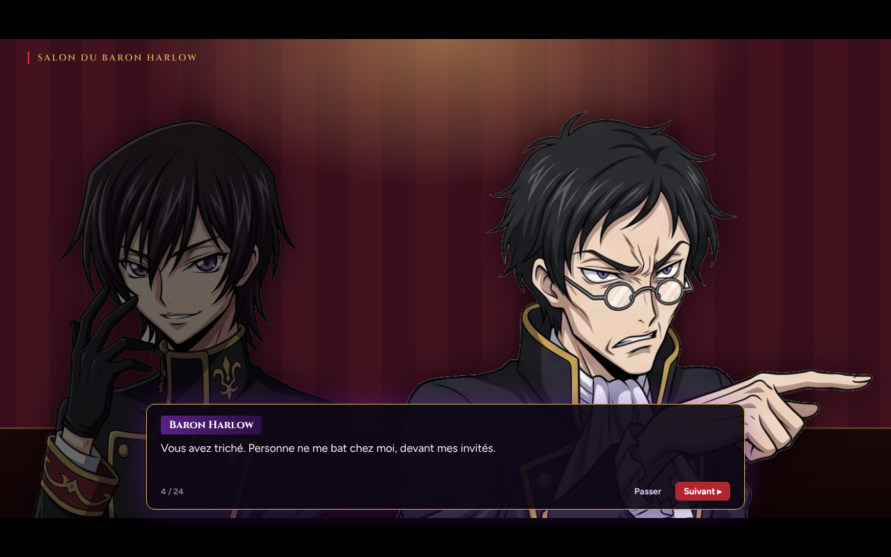
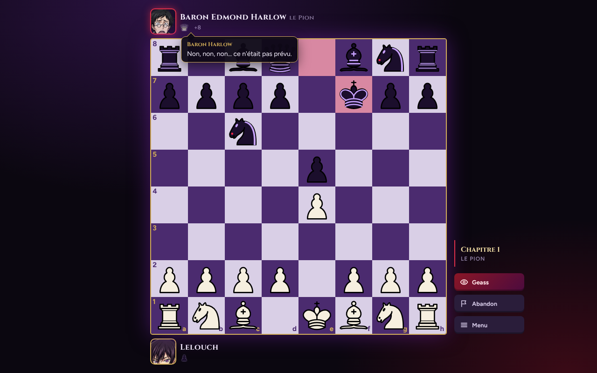
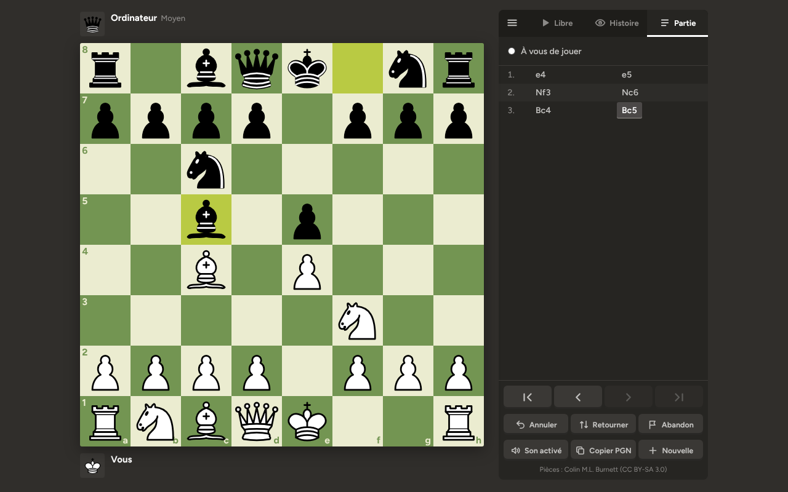

<div align="center">



**Un fan game d'échecs inspiré de Code Geass, qui se joue dans le navigateur, sans installation.**

[](https://github.com/b3ydi/echiquier-vert/actions/workflows/deploy.yml)
[](LICENSE)


### [▶ Jouer maintenant](https://b3ydi.github.io/echiquier-vert/)



</div>

## L'histoire : Le Cercle du Roi Noir

Lelouch gagne de l'argent en battant des nobles aux échecs. Un soir, le baron Harlow ne supporte pas sa défaite. Le lendemain, une dette de cinq millions portant la fausse signature de Lelouch arrive à l'Académie. Pour s'en libérer, il doit descendre sous un casino abandonné et affronter le Cercle du Roi Noir : le baron Harlow, Lady Isabella von Britannia qui finance les tables, les champions du Marquis, puis le général Hector Vance avant le Marquis lui-même.



- **Des cinématiques** présentent chaque adversaire et concluent chaque victoire : décors animés, portraits qui changent d'expression, effets du Geass, carton de chapitre.
- **Huit chapitres** de difficulté croissante : le premier est une mise en jambe, le Général et le Marquis jouent au niveau Expert.
- **Des adversaires qui parlent** : ils réagissent quand ils prennent une pièce, mettent en échec ou prennent l'avantage, et Lelouch leur répond.
- **Un Skill** : une fois par partie, l'Œil du stratège (le Geass de Lelouch) révèle le meilleur coup.
- **Une musique par adversaire**, douce au début de la partie, qui devient épique quand le match s'échauffe.
- **La progression est sauvegardée**, et une partie interrompue reprend là où elle s'était arrêtée.

<table>
  <tr>
    <td></td>
    <td></td>
  </tr>
  <tr>
    <td align="center"><sub>Match contre le baron Harlow</sub></td>
    <td align="center"><sub>Sur téléphone</sub></td>
  </tr>
</table>

## Le mode libre

Le jeu d'échecs classique, contre l'ordinateur ou à deux sur le même écran.



- **Toutes les règles** : roque, prise en passant, promotion, pat, répétition, règle des 50 coups, matériel insuffisant.
- **Contre l'ordinateur**, 5 niveaux. L'IA cherche en arrière-plan (Web Worker), l'interface ne fige jamais.
- **Pendules** avec plusieurs cadences.
- **Confort de jeu** : glisser-déposer ou clic, aperçu des coups légaux, flèches et marques au clic droit.
- **Analyse** : historique des coups navigable au clavier, export PGN en un clic.
- **5 thèmes d'échiquier**, dont le thème Geass noir, violet et or.
- **Musique et sons** synthétisés en direct, avec un bruit de pièce en bois et des pièces qui se soulèvent et se posent, réglables dans les options.

## Démarrage rapide

Aucune installation : ouvrez simplement [`src/index.html`](src/index.html) dans un navigateur.

Avec [Node.js](https://nodejs.org) 18 ou plus :

```bash
git clone https://github.com/b3ydi/echiquier-vert.git
cd echiquier-vert
npm test         # vérifie le moteur et les données de l'histoire
npm run build    # produit dist/index.html, le jeu complet en un seul fichier
```

## Structure du projet

```
echiquier-vert/
├── src/
│   ├── index.html     # structure de la page et écran titre
│   ├── styles.css     # apparence, thèmes, cinématiques
│   ├── app.js         # interface : plateau, menus, cinématiques, musique, sons
│   ├── story.js       # mode histoire : personnages, scènes, chapitres, répliques
│   ├── engine.js      # moteur : règles des échecs et intelligence artificielle
│   ├── assets/        # logo et portraits détourés (WebP)
│   └── favicon.svg
├── test/
│   ├── engine.test.mjs   # moteur (perft, fins de partie, IA)
│   └── story.test.mjs    # cohérence de l'histoire (personnages, expressions, images)
├── scripts/
│   └── build.mjs      # assemble src/ en un fichier unique dist/index.html
├── docs/              # captures d'écran du README
└── .github/workflows/
    └── deploy.yml     # tests + mise en ligne automatique sur GitHub Pages
```

## Écrire l'histoire

Tout le contenu du mode histoire se trouve dans [`src/story.js`](src/story.js), sans toucher au reste du code.

- **Une réplique** s'écrit `{who:'lelouch', e:'thinking', text:"…"}`. `who` est un personnage, `e` son expression.
- **Un décor** se choisit avec `bg` (`city`, `salon`, `academy`, `stairs`, `hall`, `opera`, `chapel`, `vault`, `warroom`, `throne`, `dawn`…), une légende de lieu avec `caption`, un effet avec `fx` (`flash`, `geass`, `shake`).
- **Un nouveau portrait** : déposez une image WebP à fond transparent dans `src/assets/` et ajoutez-la dans `chars`. Un personnage sans image apparaît en silhouette de pièce d'échecs.

`npm test` vérifie que chaque réplique pointe vers un personnage, une expression et une image qui existent.

## Sous le capot

- **Moteur** (`src/engine.js`) : génération des coups légaux sur un tableau de 64 cases, validée par [perft](https://www.chessprogramming.org/Perft_Results) sur 5 positions de référence.
- **IA** : recherche alpha-bêta avec approfondissement itératif, quiescence, tri des coups et tables pièce-case. Les niveaux faciles ajoutent un peu de hasard pour rester humains.
- **Interface** : JavaScript sans framework, SVG pour les pièces, Web Audio pour la musique et les sons.
- **Build** : un petit script Node sans dépendance qui insère CSS, JS et images dans la page.

## Mettre à jour le jeu

Chaque modification envoyée sur la branche `main` est testée puis mise en ligne automatiquement sur [b3ydi.github.io/echiquier-vert](https://b3ydi.github.io/echiquier-vert/). L'onglet **Actions** montre l'avancement. Si un test échoue, la version en ligne n'est pas touchée.

## Licence et crédits

Projet de fan non officiel, sans but commercial. Code Geass et ses personnages appartiennent à leurs ayants droit.

Code sous licence [MIT](LICENSE).
Pièces : jeu « cburnett » de Colin M.L. Burnett, sous licence [CC BY-SA 3.0](https://creativecommons.org/licenses/by-sa/3.0/).
